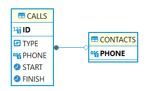

# Задание
Все звонки, совершенные абонентом сотового оператора, фиксируются в CDR файлы,
которые собираются на коммутаторах. Когда абонент находится в роуминге за процесс сбора его
данных отвечает обслуживающая сеть абонента. Для стандартизации данных между разными операторами
международная ассоциация GSMA ввела стандарт BCE. Согласно ему, данные с CDR должны агрегировать в 
единый отчет UDR, который впоследствии передается оператору, обслуживающему абонента в домашней сети.

На основе этого отчета, домашний оператор выставляет абоненту счет.
В рамках задания, CDR будут содержать записи следующего вида:
* тип вызова (01 - исходящие, 02 - входящие);
* номер абонента;
* дата и время начала звонка (Unix time);
* дата и время окончания звонка;
* разделитель данных – запятая;
* разделитель записей – перенос строки;
* данные обязательно формируются в хронологическом порядке;<br>

В рамках задания CDR может быть обычным txt;
Вот пример фрагмента CDR:
```text
02,79876543221, 1709798657, 1709799601
01,79996667755, 1709899870, 1709905806
```

UDR будет агрегировать данные по абонентам и суммировать длительность вызовов разного типа.
Пример UDR объекта для абонента 79876543221
```json
{
  "msisdn": "79876543221",
  "incomingCall": {
    "totalTime": "02:12:13"
  },
  "outgoingCall": {
    "totalTime": "00:02:50"
  }
}
```

# Решение 
Класс CdrGenerator эмулирует работу коммутатора, т.е. генерирует CDR файлы. Также он добавляет данные о звонках в
базу h2 через jdbc репозитории ContactsRepository(таблица 'Contacts') и CallsRepository(таблица 'Calls'). Они наследуются
от абстрактного класса JdbcRepository, поля которого имеют информацию о соединении и абстрактный метод инициализации.
Реализация метода должна создавать необходимые таблицы и структуры данных для корректной работы базы.
## Схема базы данных
<br>

После генерации CDR отчетов (МЕСЯЦ.txt файлы в папке reports/cdr), они анализируются классом UdrGenerator, который формирует данные для
отчетов. Отчеты в формате json создаются классом JsonWriter. После создания отчета в консоль выводится информация по 
генерации, которая зависит от сигнатуры вызванного метода:
* ```generateReport()``` – сохраняет все отчеты и выводит в консоль таблицу со всеми
абонентами и итоговым временем звонков по всему тарифицируемому периоду каждого абонента;
* ```generateReport(msisdn)``` – сохраняет все отчеты и выводит в консоль таблицу по одному
абоненту и его итоговому времени звонков в каждом месяце;
* ```generateReport(msisdn, month)``` – сохраняет отчет и выводит в консоль таблицу по одному 
абоненту и его итоговому времени звонков в указанном месяце.

Информация в консоли выводится благодаря вызову методов класса ConsoleWriter (для каждого перегруженного метода разная).
Для каждого класса созданы тесты. Класс CdrGenerator тестировался с использованием Mockito для создания заглушки 
необходимого репозитория.

## Глоссарий:
* CDR – Call Data Record – формат файла, содержащего в себе информацию о действиях, совершенных абонентом за тарифицируемый период.
* BCE – Billing and Charging Evolution – стандарт обмена роуминговыми данными.
* UDR - Usage Data Report - Отчет об использовании данных;
* msisdn  - Mobile Subscriber Integrated Services Digital Number - номер мобильного абонента цифровой сети.

